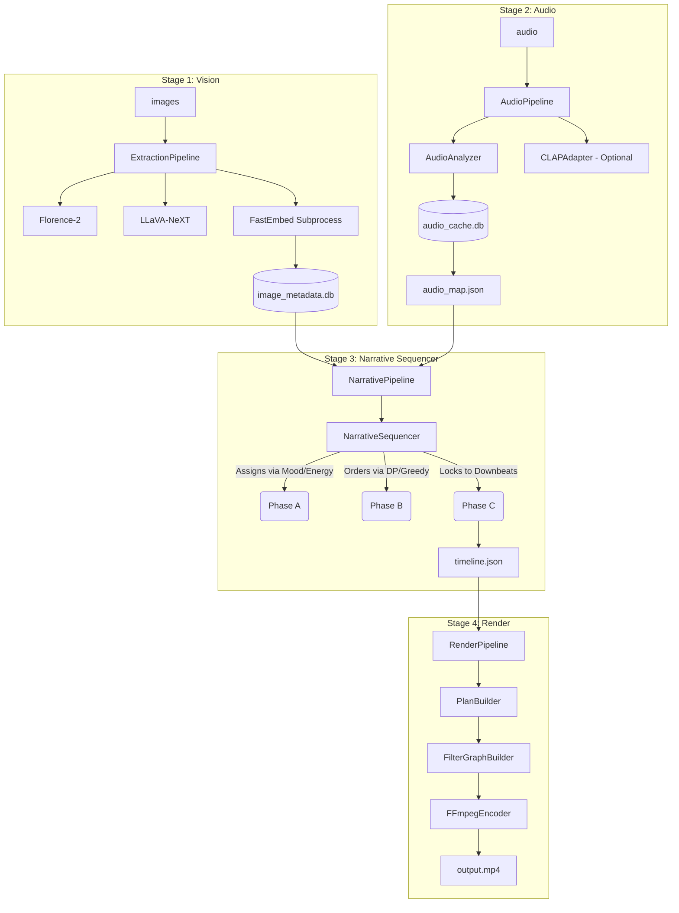

# Architecture — AI Creative Engine

The AI Creative Engine turns a folder of still images + one music track into a cinema-grade, beat-synchronized music video across **four deterministic stages**. 

Heavy ML runs on Replicate (API-first) and local sub-processes; everything else — audio analysis, sequencing math, caching, rendering — runs locally on CPU.

---

## 1. Four-Stage Data Flow



Each stage is **independent and cacheable**. Re-running any stage on identical inputs is a no-op (cache hit). The cross-stage contract files are `audio_map.json` (Stage 2 → 3) and `timeline.json` (Stage 3 → 4).

---

## 2. Module Layout

```text
src/ai_creative_engine/
├── app.py                 # Gradio Web UI; the primary entrypoint surface
├── cli.py                 # (Deprecated) Typer dispatch
├── config.py              # AppConfig; all ACE_* knobs
├── errors.py              # Typed exception hierarchy
├── models.py              # ImageMetadata (Stage-1 JSON contract)
├── cache.py               # MetadataCache (image SQLite, WAL)
├── pipeline.py            # ExtractionPipeline (Stage 1 orchestrator)
├── retries.py             # tenacity helpers
├── vision/
│   ├── florence.py        # Florence-2 client (Replicate)
│   ├── llava.py           # LLaVA-NeXT client (Replicate)
│   ├── embeddings.py      # Async embedding facade (talks to sub-process)
│   ├── embed_subprocess.py# Dedicated FastEmbed background worker
│   └── rate_limiter.py    # Request limiter for Replicate API
├── audio/
│   ├── analyzer.py        # librosa signal analysis
│   ├── audio_map.py       # AudioMap pydantic schema (Stage-2 contract)
│   ├── audio_cache.py     # AudioCache (SQLite, WAL)
│   ├── clap_adapter.py    # optional CLAP cross-modal tagging
│   ├── exporter.py        # load/export audio_map.json
│   └── pipeline.py        # AudioPipeline (Stage 2 orchestrator)
├── narrative/
│   ├── timeline.py        # Timeline pydantic schema (Stage-3 contract)
│   ├── scoring.py         # tension/energy + Hamming + JSD transition cost
│   ├── sequencer.py       # NarrativeSequencer (DP / greedy Hamiltonian)
│   ├── cache.py           # TimelineCache (SQLite, WAL)
│   ├── exporter.py        # load/export timeline.json
│   └── pipeline.py        # NarrativePipeline (Stage 3 orchestrator)
└── render/
    ├── plan.py            # PlanBuilder → frame-accurate EDL + Ken Burns
    ├── filtergraph.py     # ffmpeg filter_complex builder (zoompan + xfade)
    ├── encoder.py         # FFmpegEncoder (argv assembly + run, mockable)
    ├── drift.py           # DriftAuditor (<40ms KPI)
    ├── pipeline.py        # RenderPipeline (Stage 4 orchestrator)
    └── social_formats.py  # Aspect-ratio manipulation (cropping/letterboxing)
```

**Single-responsibility rule:** `app.py` and `cli.py` are dispatch-only. Business logic lives in the package. Reporters/renderers never touch the network or the DB directly.

---

## 3. Core JSON Contracts

All contracts are `pydantic v2` models with `extra="forbid"`.

### 3.1 `ImageMetadata` (Stage 1 → SQLite `image_metadata` row)

```jsonc
{
  "image_id": "a3f1...40hexchars",
  "file_path": "/abs/path/to/img.png",
  "width": 1920,
  "height": 1080,
  "exif": { "Make": "Canon" },            // may be null
  "florence_caption": "a red square on white",
  "objects": ["square"],
  "bounding_boxes": [[0.1, 0.1, 0.9, 0.9]],
  "llava_mood": "tense",
  "llava_tension": 0.82,                  // [0.0, 1.0]
  "llava_symbolism": "a warning sign",
  "embedding_hex": "ab12...128hexchars"   // 64-byte sign-quantized vector
}
```

### 3.2 `audio_map.json` (Stage 2 → Stage 3)

Curves are downsampled to **64 buckets** (`CURVE_BUCKETS`) regardless of track length, keeping the file ~5 KB.

```jsonc
{
  "audio_id": "1111...40hexchars",
  "file_path": "/abs/path/to/track.mp3",
  "duration": 187.42,
  "sample_rate": 22050,
  "bpm": 128.0,
  "beats": [0.464, 0.928, /* ... */],
  "downbeats": [0.464, 2.32, /* every 4th beat */],
  "onsets": [0.1, 0.52, /* ... */],
  "rms_curve": [/* 64 floats in [0,1] */],
  "spectral_contrast_curve": [/* 64 floats in [0,1] */],
  "sections": [
    { "index": 0, "start": 0.0, "end": 23.1, "label": "intro", "mean_energy": 0.21 }
  ],
  "cross_modal": [                        // null when CLAP disabled
    { "section_index": 0, "mood": "dark", "energy_word": "calm", "similarity": 0.71 }
  ]
}
```

### 3.3 `timeline.json` (Stage 3 → Stage 4)

```jsonc
{
  "audio_id": "1111...40hexchars",
  "audio_file": "/abs/path/to/track.mp3",
  "duration": 187.42,
  "bpm": 128.0,
  "downbeats_used": [0.464, 2.32, /* cut anchors */],
  "entries": [
    {
      "index": 0,
      "image_id": "a3f1...40hexchars",
      "file_path": "/abs/path/to/img.png",
      "section_index": 0,
      "start": 0.0,
      "end": 2.32,
      "transition": { "type": "cut", "duration_s": 0.0 }   // cut|dissolve|zoom
    }
  ]
}
```

---

## 4. Caching & State Strategy

Three independent SQLite caches, all WAL + `synchronous=NORMAL`:

| Cache | Table | PK | Keyed by | Module |
|---|---|---|---|---|
| image metadata | `image_metadata` | `image_id` | sha1(raw image bytes) | `cache.py` |
| audio map | `audio_map` | `audio_id` | sha1(raw audio bytes) | `audio/audio_cache.py` |
| timeline | `timeline` | `timeline_key` | composite of image-set + audio hashes | `narrative/cache.py` |

**Content-addressed → renames never invalidate; identical inputs never re-pay.**

---

## 5. Performance Characteristics

- **Embedding:** Handled by `FastEmbed` inside `embed_subprocess.py` to prevent GIL locking and main-thread hangs. Embeddings are `int8` quantized to 64-byte chunks.
- **Sequencer DP:** `O(2ⁿ·n²)` per section; `ACE_SEQUENCER_DP_THRESHOLD=12` falls back to greedy above that. Minimum shot duration of 1.5 seconds is enforced to prevent hyper-speed montages.
- **Render:** CPU ffmpeg (libx264). `filtergraph.py` bypasses `WinError 206` (command line length limits) by writing complex FFmpeg directives to a temporary filter script file.
